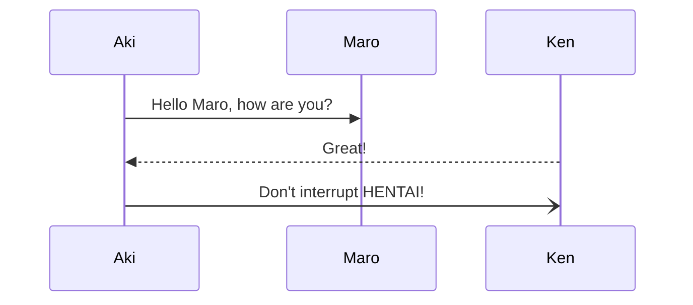

# h1 sample
## h2 sample
## h2 sample too
### h3 sample
#### h4 sample
### h3 sample too
#### h4 sample too
##### h5 sample
###### h6 sample
###### h6 sample too ?

i am a paragraph sample.
i am a paragraph sample.

i am a paragraph sample.

> aaaaaa `aaa` aaaa
>> aaaaaa `aaa` aaaa
> 
> aaaaaa `aaa` aaaa

* list sample
* list sample too
    * indent sample
        * indent sample more
    * release indent sample

| table label 1 | table label 2 | table label 3 |
| :------------ | ------------: | :-----------: |
| table value 1 | table value 2 | table value 3 |
| a             | b             | c             |

---------------------------------------------------------------



***code***

```c

int main(void){
    print("Ken->>Aki: Hi!")
    print("Aki->>Ken: Persistent!")
    return 0;
}

```

[TOC]