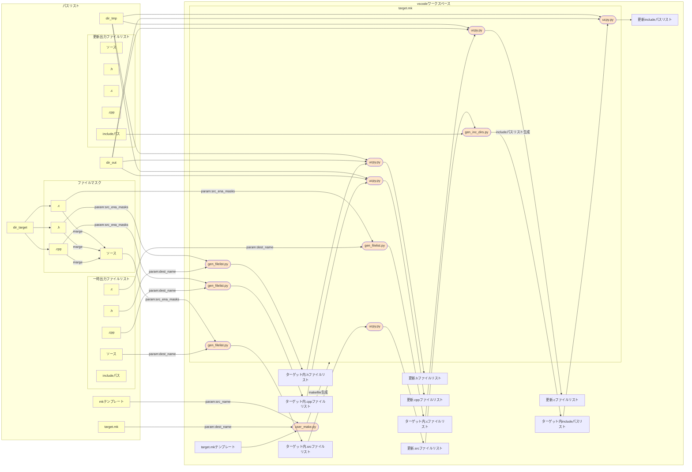

# C言語開発ツール群

個人で利用するC言語の開発ツール群です。
主な目的はvscodeでの開発支援となります。

## 対応機能

対応する機能は以下の通りとなります。

* 仕事上で行う以下の作業の実施結果を利用しやすいYAMLに変換
    * diff結果
    * コードセルフチェック・クロスチェック
    * コーディング規約チェック結果
    * ドキュメント生成結果(doxygenのXML出力など)
    * 静的解析ツール実行結果(指摘・メトリクス)
    * コンパイラ実行結果(エラー、警告)
    * リンカ実行結果(エラー、警告)
    * ソフトウェアテスト実行結果
* YAMLはまとめとしてのレポートファイルに変換して実施毎に問題かどうかを確認結果作成(基準はコーディング規約など現場の基準を用いる)
* 保存次回は同一個所の確認を省略できるようにする
* レポート確認結果は別形式(Excel/Word/pdfファイルなど)にて出力できるようにしてレポート作成工数を軽減する。

## 方針

てきとーに作っててきとーに入れます。
てきとーにご利用ください。
ライセンスはMITになってますが、まあその辺もてきとーで。

## 方針(ファイル構成について)

**パスの一元管理について**

パスを指定するのが面倒なので環境変数`path_list_path`でJSONファイルを指定し、
その中で一元管理することにしました。

指定されていない場合は`path_list.json`がカレントディレクトリに生成されます。

**make用のテンポラリフォルダについて**

Doxygenなどの生成・変換を行うツールは原則ファイルは上書きする形になります。
よって、実行のたびに内容が変わらなくてもタイムスタンプが更新されてしまい、
その結果としてmakeの更新確認が正常に動作しません。

なので結果を一時的に保存するテンポラリフォルダを作成し、
そこからファイル内容の比較で変化したファイルのみコピーすることによりファイルの更新を正常に検出させるようにします。

ただし、これでもログ内のタイムスタンプのみの変更、配置場所のデイレクトリパスの変更による検出がされる可能性があるので
これらがあることを前提としたコピー処理を追加する必要があります。

## 機能

現在の機能は下記の通り。
機能はターミナルからバッチファイルコマンドとして起動させます。
(タスクなどのvscodeの機能は起動するまでの作業が増えがちなので利用していない。)

| コマンド   | 概要                                                                       |
| ---------- | -------------------------------------------------------------------------- |
| nt         | 20_user\notes内にるmdをhtmlに変換して60_out\notesに出力します。            |
| tgt        | doxygenなどの解析対象のパスを設定します。(※1)                             |
| user_init  | ユーザパスを設定します。(※2)                                              |
| dxy        | tgtで設定した対象に対してdoxygenを実行します。出力先は60_out\doxygen(※3)  |

(※1)設定内容は20_user\tools\target_path.pyを参照
(※2)ツールのパスやユーザー拡張機能に関するパスの設定。20_user\tools\user_path.pyを参照。
(※3)現在は解析結果をyml形式に変換するまでしか対応していません。

## データフロー

### ターゲットファイルリスト

## 関連技術情報

### doxygen XMLデータの読み出しについて

doxygenのXMLデータの読み出しは生成されるスキーマ(compound.xsd)と
pythonのxsdataを利用します

まずxsdataを以下のようにインストールします。

~~~shell
pip install xsdata[cli,lxml,soap]
~~~

次にcompound.xsdのあるディレクトリにカレントディレクトリを移動させて以下を実行します。

~~~shell
xsdata compound.xsd --package doxygen_compound
~~~

doxygen_compoundディレクトリ以下にパッケージが生成されるので以下のように使用します。

~~~python
import doxygen_compound as doxygen
from xsdata.formats.dataclass.parsers import XmlParser

xml_string = ""
xml_file_path = "Z01_out/doxygen/xml/main_8c.xml"
parser = XmlParser()

with open(xml_file_path, mode="r", encoding="utf8") as f:
    xml_string = f.read()
root = parser.from_string(xml_string, doxygen.DoxygenType)
print(root)
~~~

### Visual C++のビルドエラー・警告解析

書式は下記にあるので解析して定型化し、チェッカー作れるはず。

https://learn.microsoft.com/ja-jp/cpp/build/formatting-the-output-of-a-custom-build-step-or-build-event?view=msvc-170

### GCCのビルドエラー・警告解析

未調査

### QACのレポート解析

未調査

### Jenkinsでのテスト実行＆レポート解析などの自動化

未調査

### その他ツール対応予定

未調査のツール。コマンド実行できるようならレポートとして取り込む

* CppCheck
* Sphinx
* ReVIEW
* textlint-app
* SourceMonitor
